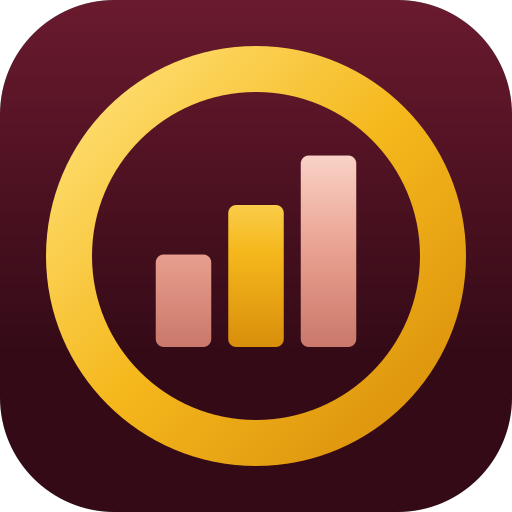
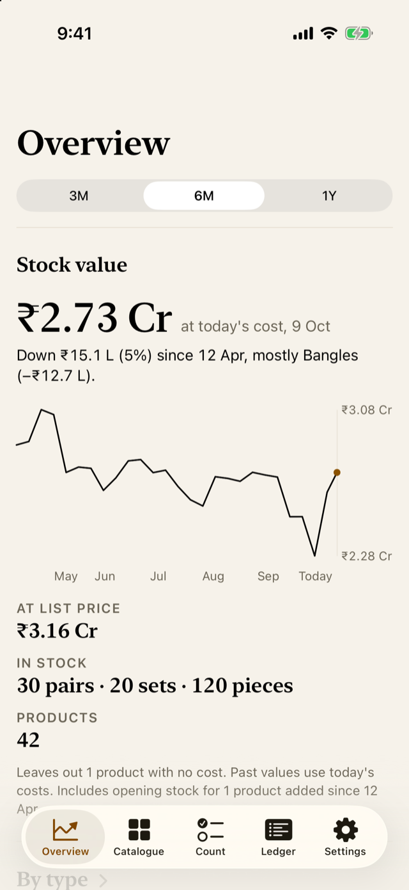
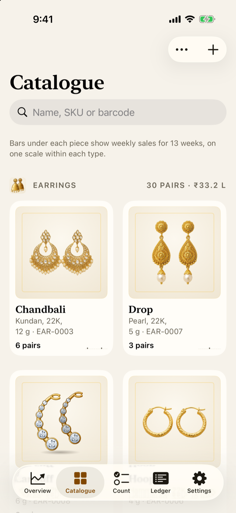
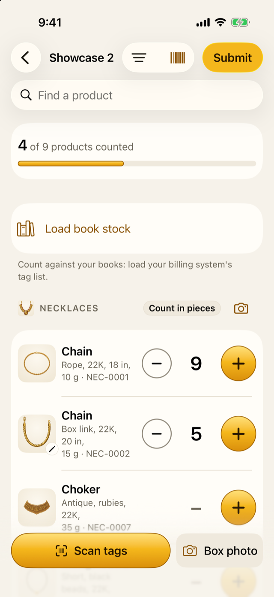
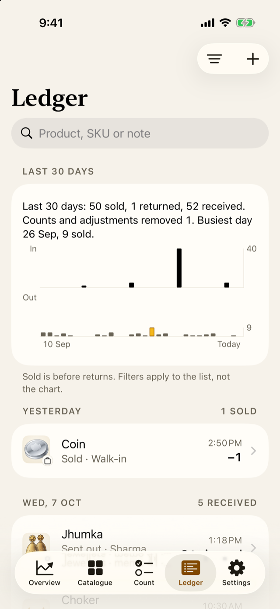

::: {.sb-hero}
::: {.app-icon}
{fig-alt="The Jholok app icon: a gold ring around three rising bars on a deep garnet ground"}
:::

::: {.sb-hero-text}
# Jholok {.sb-name}

[A stock-counting app for a jewellery shop: a catalogue, a stock ledger, and counts that are compared with the ledger before anything changes.]{.sb-sub}

[Coming soon to iOS]{.pill .soon} [Read the user guide →](jholok-guide/index.html){.pill .store} [iPhone · iOS 26 or later]{.pill}
:::
:::

::: {.shots}
{group="shots"}

{group="shots"}

{group="shots"}

{group="shots"}
:::

## What it does

**Catalogue.** Products with photo, type, variant, barcode, cost and price,
grouped by type. A spreadsheet saved as CSV imports; only name and type are
required.

**Ledger.** Stock changes only through movements: opening, received, sold,
returned, adjustment and count adjustment. Every number has a history.

**Counts.** Choose a location and the types to count, then count blind, tray
by tray. While a count is open, the stock it covers is hidden everywhere.
Review shows what matched, the units and value short or over, and what wasn't
counted, before anything is adjusted.

**Boxes.** A box of pieces can be counted from a photo or by scanning each
piece's tag. A figure from a photo is a proposal until someone checks it.

**Overview.** What the stock is worth and how it moved, what needs attention,
weekly sales, best sellers and the last count, each chart with a plain
sentence beside it.

## The user guide

[Counting your stock with Jholok](jholok-guide/index.html) is a guide for
first-time users: how to use Jholok, why it works the way it does, and the
shop and accounting ideas behind it, in plain words. Every example uses the
same made-up shop the app's demo shows.

## The shop's data

The stock, costs and photos stay on the phone, not in the cloud. With
Face ID on, Jholok locks when it opens and after a minute away, and every
export or backup asks the owner first. A backup is one file, saved where the
owner chooses.

## Requirements

An iPhone on iOS 26 or later.
