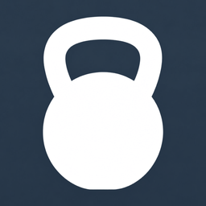
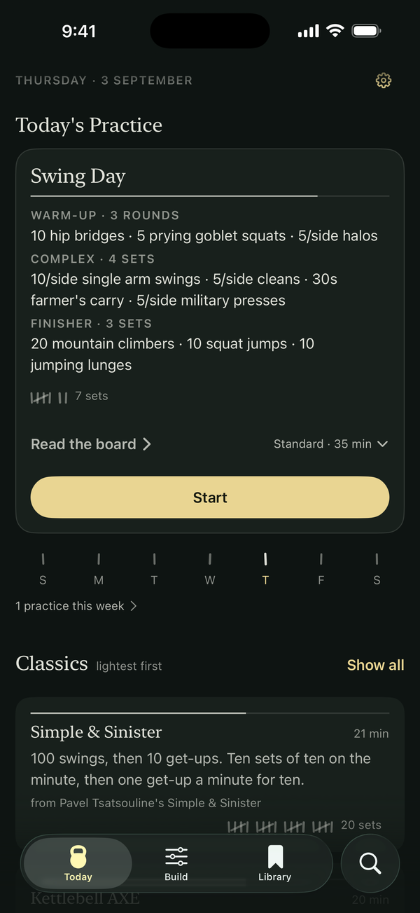
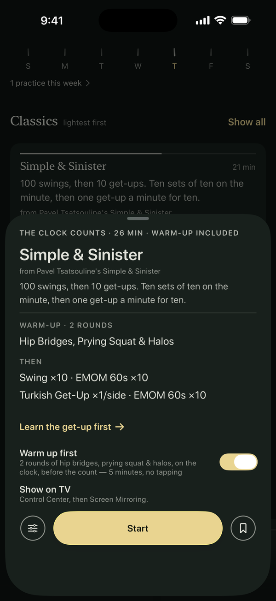
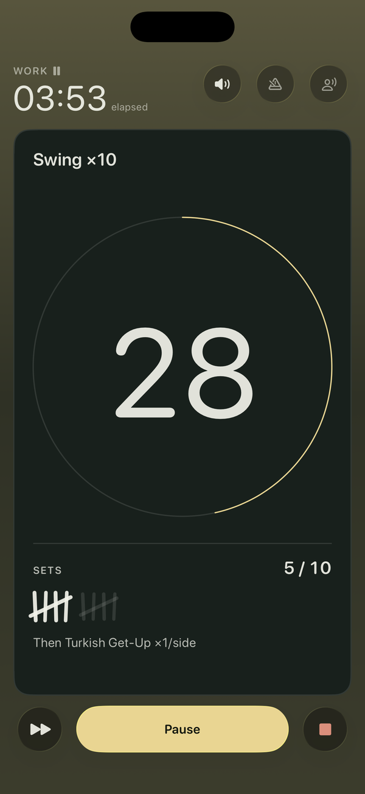
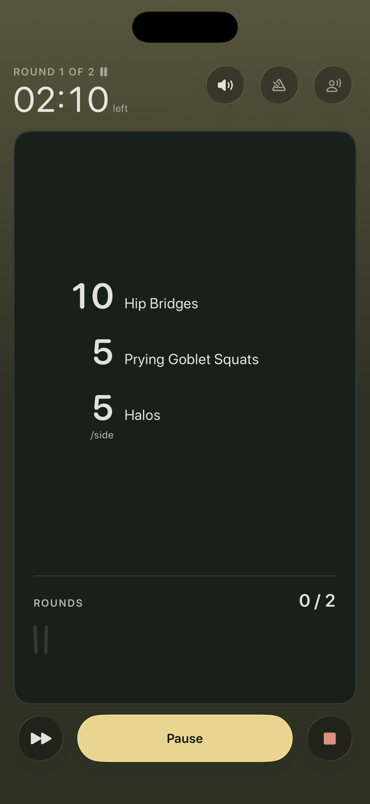
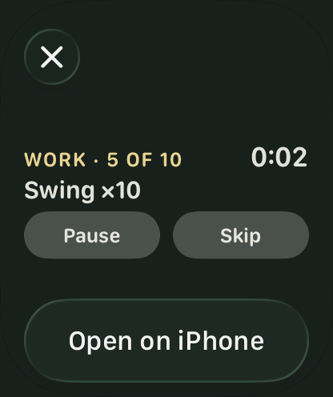
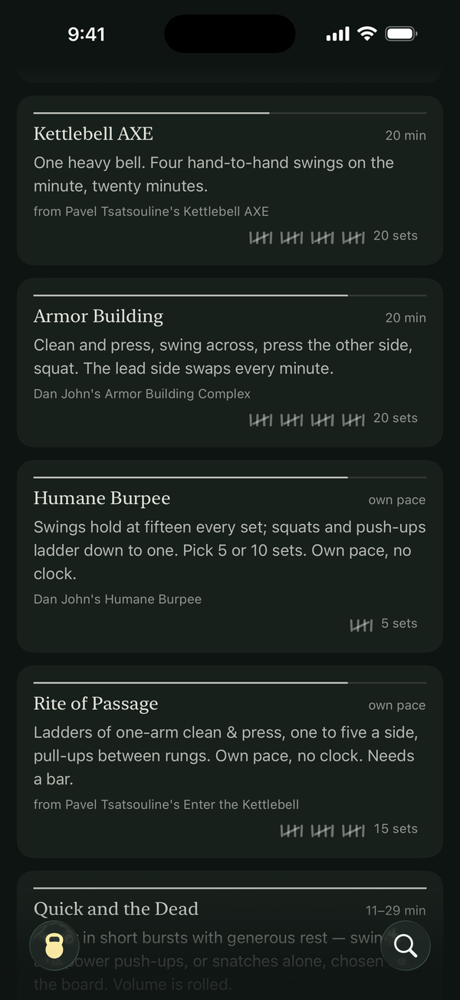
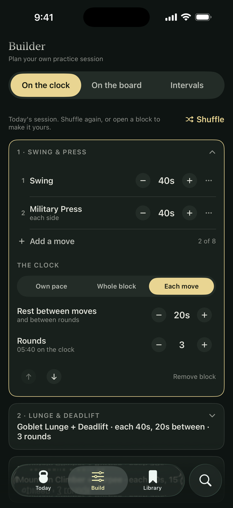

::: {.sb-hero}
::: {.app-icon}
{fig-alt="The SingleBell app icon: a chalk kettlebell on a slate ground"}
:::

::: {.sb-hero-text}
# SingleBell {.sb-name}

[A kettlebell practice app for iPhone. One bell, eight ready-made protocols, a builder for your own sessions — and the practice on your Lock Screen and your wrist while your hands are full.]{.sb-sub}

[Coming to the App Store]{.pill} [iPhone · iOS 18 or later]{.pill}
:::
:::

SingleBell is a slate, written on in chalk. It gives you one practice for the day,
counts it with you, and gets out of the way.

Native SwiftUI. No dependencies. No network code. No account.

::: {.shots}
{group="shots"}

{group="shots"}

{group="shots"}

{group="shots"}
:::

## What it does

**Today's Practice.** One full board each morning, dealt from the shape of the week and
from what you have already done: a warm-up, a kettlebell complex around the day's lift —
clean & press, one-arm swings, or the snatch — and a bodyweight finisher, chalked on the
board with an honest estimate of what it costs. Short is about twenty minutes, Standard
about thirty-five. The lift you have practised least recently leads; a snatch day waits
until you have logged a swing day; a weekend is a rest day only once the week has earned
it. Tap Light, Right or Heavy when you finish and the next board led by that lift adds or
drops a set. The day is dealt once and holds until midnight — finishing it resolves the
card in place rather than moving it under your feet.

**Day one.** New to the bell? Today opens on ten minutes of swings: three sets at your
own pace, a minute between them, one form cue at a time, ending on how the swing is done.

**The week, under the day.** Seven tally strokes, filled for the days you practised, and
behind them a practice calendar — a stroke under each day you trained, and the one word
you gave it.

**A reference.** Every move in the app has a sheet — what it is, four cues, the mistakes
to watch for — one tap from anywhere the move is named: the chalkboard, the board, the
clock, the Builder. The get-up is never dealt to you automatically, because it is a skill
before it is a set.

**Library and Search.** What you keep — the practices you saved, the last few you ran — and
one field over everything the app knows, grouped as it finds it. Every hit opens the same
chalkboard every card does.

## The practice off the screen

::: {.watch-shot}

:::

A kettlebell practice starts with your hands empty and ends with them full, and the phone
goes face-up on the floor. So the running practice leaves the screen.

**On the Lock Screen and in the Dynamic Island.** The phase in its own light, the clock,
what you are doing, what comes next, and the two controls a set actually needs — Pause,
and Skip or Set done — without unlocking the phone.

**On your wrist.** With an Apple Watch paired, the same card appears in the Smart Stack:
the phase and the clock, the movement, Pause and Set done under a thumb that never
leaves the wrist. Nothing runs on the watch — the phone draws the card and performs the
press — so there is no second app to install and nothing to keep in sync. Needs
watchOS 11.

**On the home screen.** Two widgets: today's board, dealt by the same rule Today uses, and
the week as seven strokes.

**Without opening the app.** *Start today's practice*, *Start Simple & Sinister*, *Pause*
and *Resume* are there for Siri, Spotlight and the Action Button the moment the app is
installed, with nothing to set up.

**On the wall.** Mirror the phone to a television and the practice gets a room drawn for
that screen — the number at whatever size the set can carry, the movement under it, the
phase in one corner — while the controls stay under your thumb on the phone.

## The room

Only practices with a clock get the clock; a practice you count yourself gets a board with
every set chalked on it from the start, filling in as you tap. Both are lit the same way:
**the whole room changes temperature with the phase** — warm for work, cool for rest,
neutral while you get ready or pause — so you can tell where you are from across the
garage with the text blurred out. The digits are drawn to be read from the floor. Turn the
phone on its side and the room turns with it.

Beeps cut through music and keep going when the screen locks; a voice can name each block
if you want it; your music plays at full volume underneath. The clock survives a phone
call, or the app being closed, and picks up where it left off. The finish happens in
place — *Put the bell down.* — with one optional question, and ending early asks first,
on the slate, in the app's own words.

## The classics

The protocols the kettlebell world already runs, each credited on its own board and
adjustable before you start.

::: {.shot-right}

:::

[Simple & Sinister]{.name} — 100 swings, then 10 get-ups. Ten sets of ten on the minute,
then one get-up a minute for ten. *Pavel Tsatsouline.*

[The Quick and the Dead]{.name} — power in short bursts with generous rest: swings and
power push-ups, or snatches alone, chosen on the board. *Pavel Tsatsouline.*

[Rite of Passage]{.name} — ladders of one-arm clean & press, one to five a side, pull-ups
between rungs. Own pace, no clock. *Pavel Tsatsouline, Enter the Kettlebell.*

[Kettlebell AXE]{.name} — one heavy bell, four hand-to-hand swings on the minute, twenty
minutes. *Pavel Tsatsouline.*

[Armor Building Complex]{.name} — clean and press, swing across, press the other side,
squat. The lead side swaps every minute. *Dan John.*

[Humane Burpee]{.name} — swings hold at fifteen every set while squats and push-ups ladder
down to one. Pick five sets or ten. *Dan John.*

[Advanced Minimalist]{.name} — snatches alone, two minutes on and two off, with the series
and rep scheme rolled fresh. *Pavel Tsatsouline, The Quick and the Dead.*

[The Simple & Sinister Warm-up]{.name} — hip bridges, prying goblet squats, halos; three
rounds. It opens Today's Practice, and any practice can warm up first.

Each one can be re-paced on the slate before it starts: run Simple & Sinister on the
minute or at your own pace, swap the get-up out if you haven't learned it yet, run
Quick and the Dead as snatches alone, tighten the Axe to every thirty seconds, choose
the Humane Burpee's set count.

## Build your own

::: {.shot-right}

:::

The Builder has three rooms behind one control: [on the clock]{.name}, where the app counts
the intervals; [on the board]{.name}, the same complex written up as a whiteboard where you
count the sets; and plain [intervals]{.name} — work and rest in rounds, rounds in sets — for
work that isn't a complex at all.

Sessions are made of blocks. A block is a complex — up to eight moves from any
shelf of the catalog, in the order you chalk them, each with its own count. One lift on
a clock is the special case, not the shape.

Each block decides how the clock treats it: own pace, a timer on the whole
block (Tabata, EMOM, AMRAP), or a timer on each move as stations, with its own rest and
its own number of rounds. Every number is dialled, not picked off a list. Blocks reorder,
collapse, and stack into a session as long as you need. Shuffle deals a fresh one to start
from, and anything you build can be saved to Library and run again.

A half-built session is still there when you come back to it.

## Accessibility

Every line of type follows the text size you set, into the accessibility sizes, and
nothing shrinks a label to fit. Reduce Motion turns the springs into one fade and the
room's light into a cut. Reduce Transparency gives the floating controls their opaque
form. Increase Contrast firms the chalk; Bold Text is answered on every line. The app is
a dark slate at every hour, by design — there is no light appearance to switch to.

## What it deliberately doesn't do

No streaks. No badges. No confetti. No charts or stat dashboards. No social feed, no
followers, no sharing. No account. No ads. No motivational copy, and not one
exclamation mark anywhere in the app.

The absence is the point. A practice you keep is not one you were nagged into.

## Requirements

An iPhone on iOS 18 or later. The Smart Stack card needs an Apple Watch on watchOS 11,
paired to that phone. There is no iPad version and no separate watch app.

## Privacy {#privacy}

*Effective 3 September 2026.*

**SingleBell collects nothing.** Not anonymised, not aggregated, not "to improve the
experience". Nothing. The rest of this section is only the detail behind that sentence.

### Nothing leaves your phone

The app contains no networking code at all. It does not connect to a server, because
there is no server. There is no account to create, nothing to sign in to, and no way
for me — or anyone else — to see that you use the app, let alone what you do in it.

There are no analytics, no crash reporters, no advertising identifiers, no attribution
frameworks, and no third-party SDKs of any kind. The only crash reports that exist are
the ones Apple collects for every app, if you have opted in to sharing those with
developers in your iOS settings.

### It asks you for nothing

SingleBell requests no permissions. Not your location, contacts, photos, calendar,
microphone, camera, or Health data. It is not integrated with HealthKit. The app declares
no permission that would produce a prompt. The one system question you may see is iOS
asking, once, whether to allow Live Activities from SingleBell — that is the system's
question about its own Lock Screen, and answering No costs you only the card.

The coach's voice is your device's built-in speech synthesis — sound going out, never
sound coming in. Nothing is recorded and nothing is listened to. The app keeps audio
running in the background for one reason: so the count keeps speaking when your screen
locks mid-set.

### What is stored, and where

Everything the app remembers is written to your phone's own storage, in a container
shared only between SingleBell and its own widgets — that sharing is what lets the
home-screen widget show today's board. That container is on your phone and nowhere else.
It holds:

- **your settings** — the sound switches and cue volume, whether you have a pull-up bar,
  whether practices warm up first, how long Today's Practice runs, the get-ready count,
  and whether you have put the "Start here" card away;
- **your Library** — the practices you chose to save, and any move you typed in yourself;
- **a list of the practices you finished, and when** — which practice, the date, how long
  it took, and the one optional word from the closing screen, Light, Right or Heavy. It
  marks the practice calendar, lets a chalkboard say "last run 9 days ago", and picks
  which lift Today's Practice leads with. That is everything it is used for;
- **the last six practices you ran**, so the Library can offer them again;
- **a practice in progress**, so an app closed mid-workout can offer it back, forgotten
  within two hours or as soon as the practice ends; and the half-built board in the
  Builder, kept for the day it was written.

What it does not keep: no times per set, no reps counted, no streaks, no personal bests,
no bodyweight, no bell weight, no goals.

### The practice off the screen

The Lock Screen card, the Dynamic Island and the Apple Watch card are one Live Activity,
drawn on your phone by the app itself. It uses no push token and no notification server.
iOS carries it to a paired watch the way it carries every Live Activity, over the pairing
you already have; nothing runs on the watch, and the card disappears when the practice
ends. Siri, Spotlight and the Action Button hand the app a request and nothing about how
it was made. Mirroring to a television is done by iOS, over your own AirPlay connection
or a cable — the app draws the second screen and still contains no network code.

### Backups

If your phone backs itself up to iCloud or to a computer, that backup will include
SingleBell's data exactly as it includes every other app's. Those backups are covered
by Apple's privacy policy, not by this one.

### Deleting it

Delete the app and everything goes with it. There is no copy held anywhere else and
nothing to request from me, because I never had it in the first place.

### Children

No data is collected from anyone, of any age.

### Changes

If any of this ever stops being true, this page will say so before the version that
changes it ships, and the date above will change.

### Contact

Questions about this policy: [absk.bhtt@gmail.com](mailto:absk.bhtt@gmail.com).

## Support {#support}

SingleBell has no account and keeps nothing off your phone, so there is nothing for me to
look up on your behalf — but a bug, a question or a request is welcome at
[absk.bhtt@gmail.com](mailto:absk.bhtt@gmail.com).

If it is a bug, the three things that help most are which iPhone and iOS version you are
on, what you tapped, and what you expected to happen instead. A screenshot of the room
says more than a paragraph. Nothing in a screenshot of SingleBell is personal to you
beyond the practices you chose to run.
