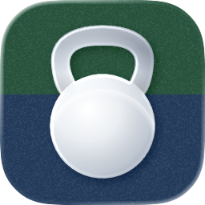
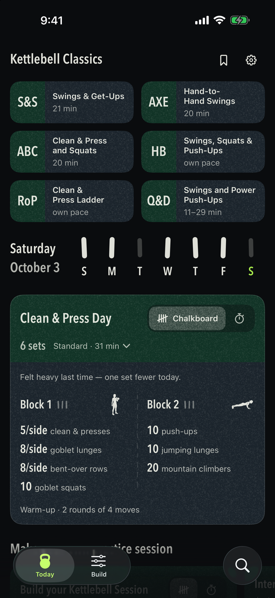
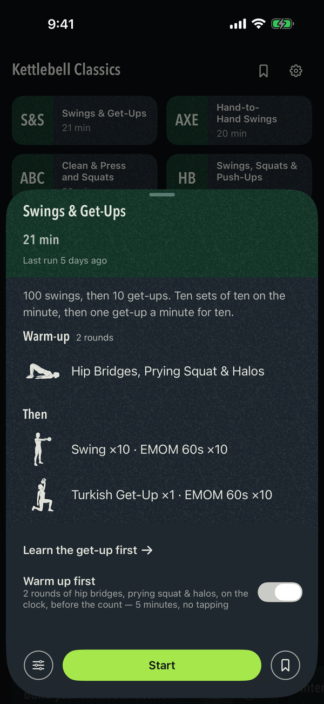
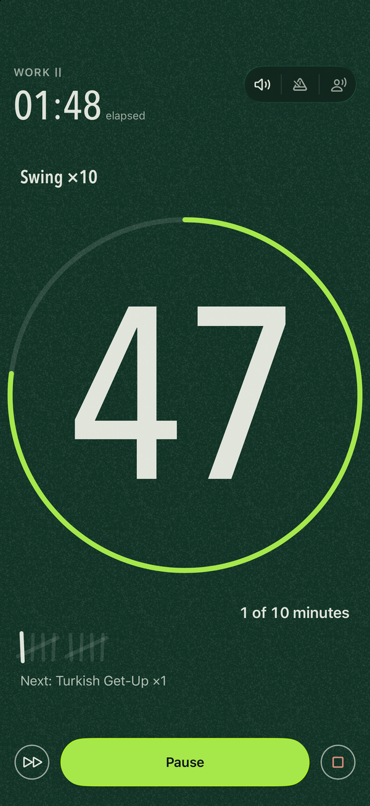
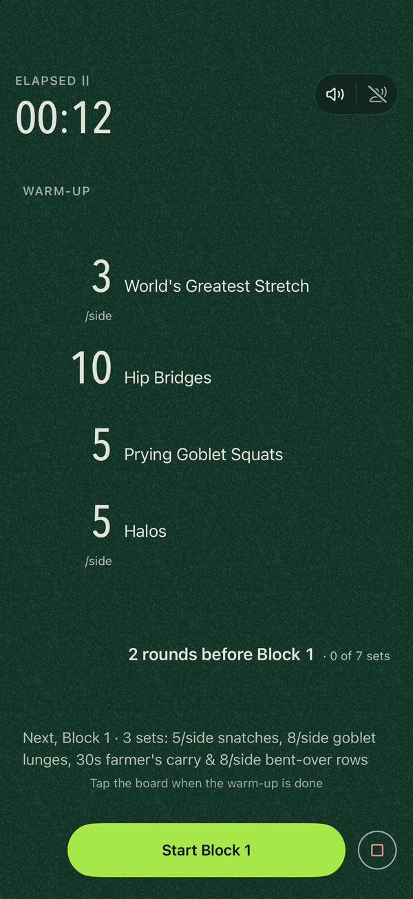
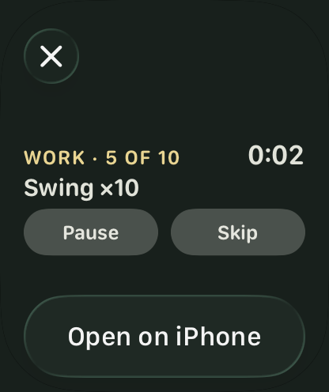
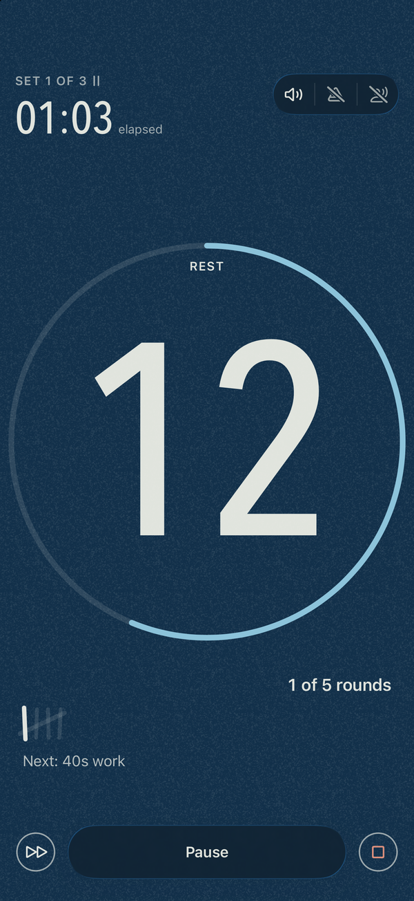
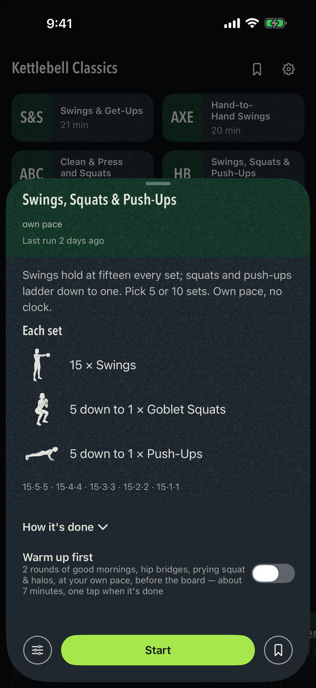
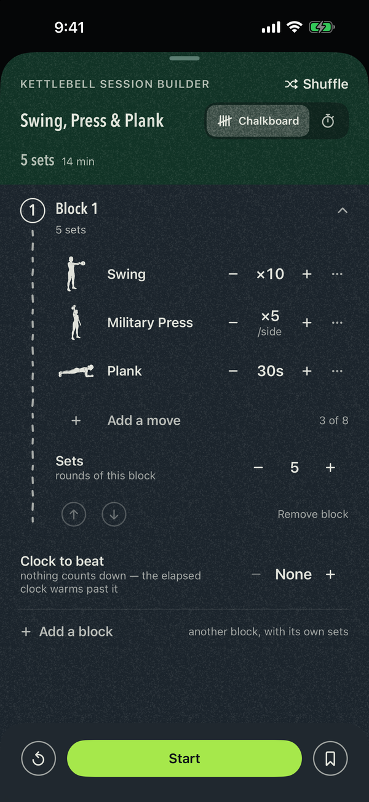

::: {.sb-hero}
::: {.app-icon}
{fig-alt="The SingleBell app icon: a white glass kettlebell on a pine green and slate blue ground"}
:::

::: {.sb-hero-text}
# SingleBell {.sb-name}

[A kettlebell practice app for iPhone. One bell, six classic protocols, a builder for your own sessions — and the practice on your Lock Screen and your wrist while your hands are full.]{.sb-sub}

[Download on the App Store →](https://apps.apple.com/app/singlebell-kb-practice/id6805588015){.pill .store} [iPhone · iOS 18 or later]{.pill}
:::
:::

SingleBell is a slate, written on in chalk. It gives you one practice for the day,
counts it with you, and gets out of the way.

Native SwiftUI. No dependencies. No network code. No account.

::: {.shots}
{group="shots"}

{group="shots"}

{group="shots"}

{group="shots"}
:::

## What it does

**Today's Practice.** One full board each morning, dealt from the shape of the week and
from what you have already done: a warm-up chosen for the day's lift, a kettlebell
complex around that lift — clean & press, one-arm swings, or the snatch — and a
bodyweight finisher, chalked on the board with an honest estimate of what it costs. Short
is about twenty minutes, Standard about thirty-five. Run it at your own pace, striking
each set as you finish it, or timed, on the clock — one switch on the card. The lift you
have practised least recently leads, and a snatch day waits until you have logged a swing
day. Rest when you decide to: the app never declares a rest day, and the week beside the
date shows what it has had. Tap Light, Right or Heavy when you finish and the next board
led by that lift adds or drops a set. The day is dealt once and holds until midnight — finishing it
resolves the card in place rather than moving it under your feet. Either side of Start
are two doors: open the day in the Builder and make it yours, or keep it in your Library
as dealt.

**Start here.** A fresh install carries one more card: a first practice in the app, not a
first bell — ten minutes of two-hand swings, three sets at your own pace, a minute between
them, one of the swing's cues a set, ending on how the swing is done. Put it away by hand,
or it goes after three practices.

**The week, beside the date.** Seven tally strokes, filled for the days you practised. A
tap opens the practice calendar — the strokes under each day you trained, the one word you
gave each practice, and the last six you ran, ready to run again. A chalkboard remembers
too: "Last Snatch Day 4 days ago · 8 sets · felt heavy".

**A reference.** Every move in the app has its own figure and a sheet — what it is, four
cues, the mistakes to watch for, how the board counts it — one tap from anywhere the move
is named: the chalkboard, the board, the clock, the Builder. Opened from a board, the sheet
says what that board asks. The get-up is never dealt to you automatically, because it is a
skill before it is a set.

**Library and Search.** The bookmark beside the Classics opens what you kept. The round
button at the foot of Today raises one field over everything the app knows — moves,
Classics, your saves and every practice you have finished — grouped as it finds it. Every
hit opens the same chalkboard every card does.

## The practice off the screen

::: {.watch-shot}

:::

A kettlebell practice starts with your hands empty and ends with them full, and the phone
goes face-up on the floor. So the running practice leaves the screen.

**On the Lock Screen and in the Dynamic Island.** The phase in its own light, the clock,
what you are doing, what comes next, and the two controls a set actually needs — Pause,
and Skip or Set done — without unlocking the phone.

**On your wrist.** With an Apple Watch paired, the same card appears in the Smart Stack:
the phase and the clock, the movement, Pause and Set done under a thumb that never
leaves the wrist. Nothing runs on the watch — the phone draws the card and performs the
press — so there is no second app to install and nothing to keep in sync. Needs
watchOS 11.

**On the home screen.** Two widgets: today's board, dealt by the same rule Today uses, and
the week as seven strokes.

**Without opening the app.** *Start today's practice in SingleBell*, *Start swings and
get-ups in SingleBell*, *Pause* and *Resume* are there for Siri, Spotlight and the Action
Button the moment the app is installed, with nothing to set up.

**On the wall.** Mirror the phone to a television and the practice gets a room drawn for
that screen — the number at whatever size the set can carry, the movement under it, the
phase in one corner — while the controls stay under your thumb on the phone.

## The room

::: {.shot-right}

:::

Only practices with a clock get the clock; a practice you count yourself gets a board with
every set chalked on it from the start, filling in as you tap. Both are lit the same way:
**the whole room changes colour with the phase** — green for work, blue for rest, slate
while you get ready — and the ring says the phase in a word, so you can tell where you
are from across the garage with the text blurred out. The digits are drawn to be read
from the floor. Turn the phone on its side and the room turns with it.

Beeps cut through music and keep going when the screen locks; a voice can name each block
if you want it; your music plays at full volume underneath. A phone call pauses the
clock, and a practice the app was closed on is offered back where it left off. The finish
happens in place — *Put the bell down.* — with one optional question, *How did the sets
feel?*, and Undo beside Close if a stray tap finished it. Ending early asks first, on the
slate, in the app's own words.

## The classics

The protocols the kettlebell world already runs, each named for what it asks and
adjustable before you start.

::: {.shot-right}

:::

[Swings & Get-Ups]{.name} — 100 swings, then 10 get-ups. Ten sets of ten on the minute,
then one get-up a minute for ten.

[Swings and Power Push-Ups]{.name} — power in short bursts with generous rest: swings and
power push-ups, or snatches alone, chosen on the board.

[Clean & Press Ladder]{.name} — ladders of one-arm clean & press, one to five a side, pull-ups
between rungs. Own pace, no clock.

[Hand-to-Hand Swings]{.name} — one heavy bell, four hand-to-hand swings on the minute, twenty
minutes.

[Clean & Press and Squats]{.name} — clean and press, swing across, press the other side,
squat. The lead side swaps every minute.

[Swings, Squats & Push-Ups]{.name} — swings hold at fifteen every set while squats and push-ups ladder
down to one. Pick five sets or ten.

Each one can be re-paced on the slate before it starts: run Swings & Get-Ups on the
minute or at your own pace, swap the get-up out if you haven't learned it yet, run
Swings and Power Push-Ups as snatches alone, tighten Hand-to-Hand Swings to every thirty
seconds, lengthen or shorten Clean & Press and Squats or run it on 45- or 90-second
rounds, end the Clean & Press Ladder on ten minutes of swings or snatches, choose the set
count for Swings, Squats & Push-Ups.

**Warm up first.** Every board carries the switch, on until you turn it off. Swings &
Get-Ups warms up on its own trio. Everything else takes a round dealt for what follows —
the world's greatest stretch before anything that goes overhead, good mornings before
swings, jumping jacks otherwise, the trio under it — for two rounds: each move its own
station on the clock, or one block marked down with a tap on a board. About seven minutes
in front of a classic.

## Make your own

::: {.shot-right}

:::

**The Builder.** One practice, two ways to run it: the switch at its head reads
[Own pace]{.name} or [Timed]{.name} — a board where you strike each set, or the same blocks
on the clock.

Sessions are made of blocks. A block is a complex — up to eight moves from any
shelf of the catalog, in the order you chalk them, each with its own count. One lift on
a clock is the special case, not the shape.

Timed, each block decides how the clock treats it: one timer on the whole block (Tabata,
EMOM, AMRAP), or a timer on each move as stations, with its own rest, its own number of
rounds and a minute between them. Every number is dialled, not picked off a list. Blocks
reorder, collapse, and stack into a session as long as you need. Shuffle deals a fresh one
to start from, and anything you build can be saved to Library and run again. A half-built
session is still there when you come back to it, that day.

**The Intervals Timer.** Just a clock, no moves: work and rest in rounds, rounds in sets, a
breather between sets — from 20/10 to 60/30 in one tap, every number dialled after that,
and the whole thing read back to you in one sentence before you start.

**Mobility sessions.** Short sessions for the days in between, each on its own card:
Hip Bridges, Prying Squat & Halos — the round that opens Swings & Get-Ups — and others
like it, at your own pace.

## Accessibility

Every line of type follows the text size you set, into the accessibility sizes, and
nothing shrinks a label to fit; Today still fits the screen at the largest of them. Reduce Motion turns the springs into one fade and the
room's light into a cut. Reduce Transparency gives the floating controls their opaque
form. Increase Contrast firms the chalk; Bold Text is answered on every line. The app is
a dark slate at every hour, by design — there is no light appearance to switch to.

## What it deliberately doesn't do

No streaks. No badges. No confetti. No charts or stat dashboards. No social feed, no
followers, no sharing. No account. No ads. No motivational copy, and not one
exclamation mark anywhere in the app.

The absence is the point. A practice you keep is not one you were nagged into.

## Requirements

An iPhone on iOS 18 or later. The Smart Stack card needs an Apple Watch on watchOS 11,
paired to that phone. There is no iPad version and no separate watch app.

## Privacy {#privacy}

**SingleBell collects nothing.** Not anonymised, not aggregated, not "to improve the
experience". Nothing. The [privacy policy](privacy.qmd) is the detail behind that sentence.

```{=html}
<script>if (location.hash === "#privacy") location.replace("privacy.html");</script>
```

## Support {#support}

SingleBell has no account and keeps nothing off your phone, so there is nothing for me to
look up on your behalf — but a bug, a question or a request is welcome at
[absk.bhtt@gmail.com](mailto:absk.bhtt@gmail.com).

If it is a bug, the three things that help most are which iPhone and iOS version you are
on, what you tapped, and what you expected to happen instead. A screenshot of the room
says more than a paragraph. Nothing in a screenshot of SingleBell is personal to you
beyond the practices you chose to run.
