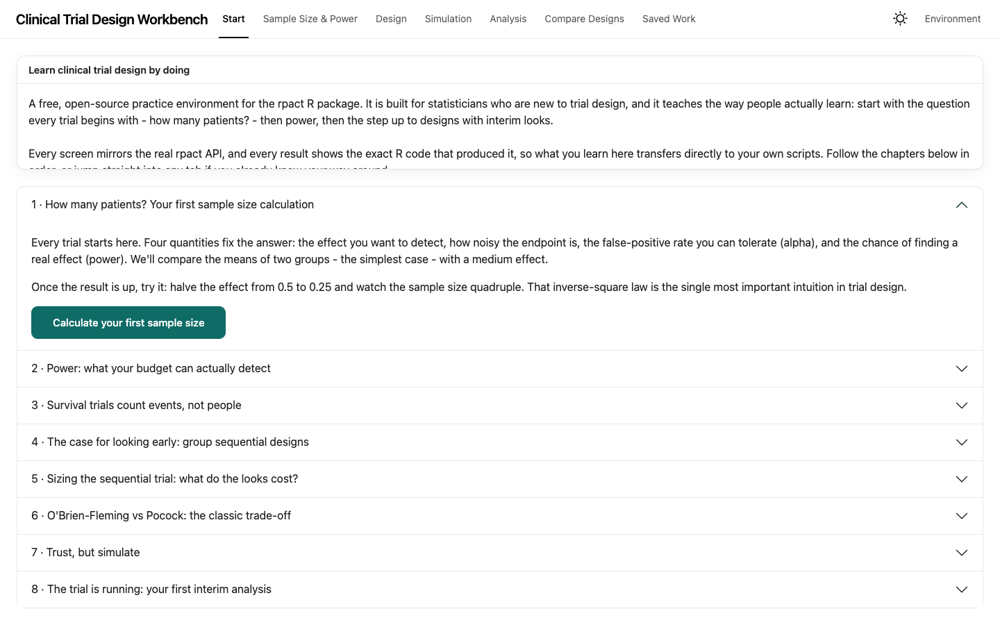

::: {.hero-links}
[Open the workbench](https://stat-absk-ct-dashboard.share.connect.posit.cloud/)
[Follow the tutorial](https://github.com/stat-absk/CT_Dashboard/blob/main/TUTORIAL.md)
[Quick-start guide](https://github.com/stat-absk/CT_Dashboard/blob/main/USER_GUIDE.md)
[Source on GitHub](https://github.com/stat-absk/CT_Dashboard)
:::

The workbench is a place to learn trial design by doing it. It is built for
statisticians who are new to the field, and it teaches the way people actually
learn: start with the question every trial begins with — how many patients? —
then power, then the step up to designs with interim looks.

Nothing is hidden behind the interface. Every form mirrors the
[rpact](https://www.rpact.org) R package's own functions, and every result is
shown with the exact R code that reproduces it, so what you learn in the app
transfers directly to your own scripts.

::: {.wide-shot}

:::

## What's inside

Every rpact function family has an interface, organised the way the work is
actually done.

[Design]{.name} — group sequential boundaries: O'Brien–Fleming, Pocock,
Haybittle–Peto, alpha-spending families, and the characteristics and plots
that let you read what a boundary costs.

[Sample size & power]{.name} — means, rates, and survival endpoints; survival
planning with accrual and follow-up; and the conversion calculators that turn
medians into hazard rates and back.

[Simulation]{.name} — check a design's operating characteristics by simulation
before you trust them, including multi-arm and population-enrichment designs.

[Analysis]{.name} — enter interim data and monitor a running trial: stage
results, test actions, conditional power, repeated confidence intervals, and
the final inference once a boundary is crossed.

[Compare]{.name} — put two saved designs side by side and see where they
differ.

Anything you compute can be saved, carried into the next calculation, exported
as an HTML report, or written to a session file and restored later.

## Learn by doing

The Start tab holds eight guided chapters that seed the objects the rest of
the app builds on. Behind them sit **64 worked examples across 58 functions**
— every feature in the app has at least one example you can load with a
click, run, and then bend: each one ends with a "try changing this" prompt
and an interpretation of what the numbers mean.

The [tutorial](https://github.com/stat-absk/CT_Dashboard/blob/main/TUTORIAL.md)
turns those examples into a follow-along course. Each exercise names what to
load, what numbers to expect, and what to try next; the numbers quoted are
verified against rpact 4.4.0. It closes with a capstone that designs,
simulates, and analyses an anti-hypertensive trial end to end. If you only
want your bearings, the shorter
[quick-start guide](https://github.com/stat-absk/CT_Dashboard/blob/main/USER_GUIDE.md)
covers the layout and the first calculation.

## What it is, and isn't

The workbench is a teaching tool. It is free, open source
([LGPL-3](https://github.com/stat-absk/CT_Dashboard/blob/main/LICENSE.md)), and
runs entirely on the [rpact](https://www.rpact.org) package — the validated,
widely used R implementation of confirmatory adaptive trial methodology by
Gernot Wassmer and Friedrich Pahlke. All of the statistical machinery is
theirs; the workbench only sets a table for learning it. It is not a validated
GxP system, and a design headed for a protocol should be reproduced in rpact
itself — which is exactly what the R code under every result is for.

[The workbench is a personal open-source project and is not affiliated with my employer or with the rpact team.]{.disclaimer}
